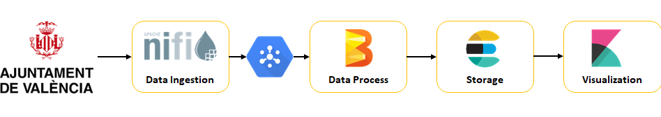

# Hackathon 2: Improve Smart City application

Valencia City Hall has already a control dashboard to visualize Valenbici stations status on real time. 
With this tool, they schedule bicycle movements to ensure availability, and also can do analytics to improve the network adding more slots or creating new stations. 

Here you can have high level architecture of the application provided. 



## Setup

We are  going to use already provided ElasticStreaming Virtual Machine, but we need to configure it to use 6GB of RAM. 


* Open Web Browser and go to  http://console.cloud.google.com/

* Create a new project called hackathon.


* Go to pub/sub on left panel and create topic calling it valenbisi.


* Click to the topic already created go down and click on Create Subscription called streaming, left rest as default:


* Donwload key to be able to consume and populate messages to pub/sub. 
** Go to left panel to IAM & admin --> Service accounts
** Click on Create Service  Account
** Create service account called streaming, and click on Continue

** Add permissions to pub/sub read and consume, and click Continue

** Clilck on Create key, select JSON as key type and finally on Done. That will download a Json file with your credentials


* Open a terminal and move the json key downloaded to Crendentials folder. Run the following:
```
cp Downloads/your_downloaded_credentials.json Credentials/mobilityApp.json
```  

* Create google environment variable to point to this key file. Run the following:
```
export GOOGLE_APPLICATION_CREDENTIALS=/home/edem/Credentials/mobilityApp.json
```  

Create a directory to donwload the Mobility application. Run the following:
```
mkdir hackathon
cd hackathon
git clone https://github.com/rlopezherrero/GFT-EDEM-MasterData.git
```

* Install elastic module for python. Run the following:
```
pip install elasticsearch
```

## Run the platform

* Launch elasticsearch:
** Open a terminal and run the following
```
Software/elasticsearch-7.4.2/bin/elasticsearch
```  

* Launch kibana:
```
Software/kibana-7.4.2-linux-x86_64/bin/kibana
```  

* Open web browser to validate that kibana has been launched successfully --> http://localhost:5601

* Setup the Dashboards. 


## Launching the application

Here you can find a detailed diagram of the application provided:


* Launch Streaming application:
** Open a terminal and configure google credentials running the following:
```
export GOOGLE_APPLICATION_CREDENTIALS=/home/edem/Credentials/mobilityApp.json
```  
** Launch spyder running 
```
spyder
```  
** Open mobility application downloaded available on /home/edem/Exercises/hackathon/GFT-EDEM-MasterData/Hackathon/Streaming/ElasticWritter.py

** Launch it and check the console to  see that is running without errors.


* Launch Nifi:
** Open a terminal and configure google credentials running the following:
```
export GOOGLE_APPLICATION_CREDENTIALS=/home/edem/Credentials/mobilityApp.json
```  
** Launch Nifi application
```
Software/nifi-1.9.2/bin/nifi.sh run
```  
** Load Valenbici template available on /home/edem/Exercises/hackathon/GFT-EDEM-MasterData/Hackathon/nifi/mobilityIngestion.xml
```

** Go to the Pub/Sub publisher Box, click on properties and configure the project to use your google project id created. 

* Finally launch the workflow. 

* Validate on  Spyder console that you see the messages printed. 

* Go to Kibana dashboard and see that you see it updated on real time. 


